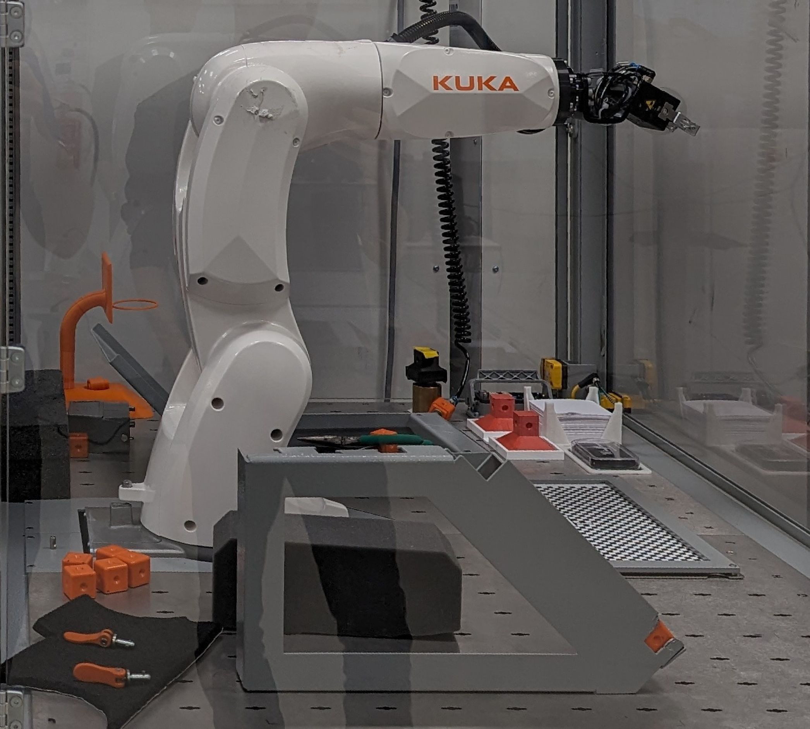
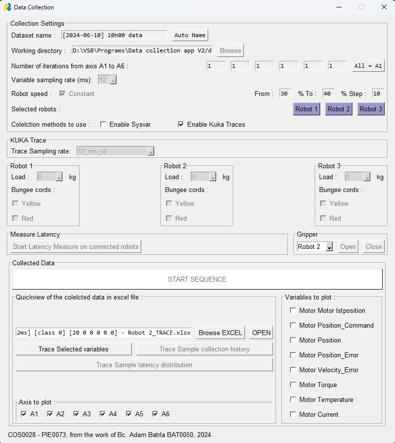

# Data collector

This tool is made to collect and plot sensor data from KUKA KR 3 R540 robotic arm. 
It collects the system vairables via a custom KRL submodule and trace data from
the KUKA Trace module of the robot controler.

For the tests, we can use three idetntical KUKA Cell with robotic arms, as one is shown here :



The robot is driven by a controler, that takes care of the power supply of each DC 
motor independantly, robot program, memory and security. A robot program is stored in 
a text format in .src file, associated with a .dat file for program data, each written 
in KRL programming language. Global variables, which can be accessed by Python, are 
located in $config.dat file. Among global variables there are system variables in read 
only access, and this Python tool use it to collect data from the robot.

As the purpose of this tool is to make a diagnosis on the robot arm health, the robot 
program is a full-range motion on each axis of the robot. One motor iteration consists 
of a axis movement by a defined angle from the default position, on positive then negative 
side. Data analysis for diagnosis is curenly in developement.

For each of the 6 motors of the robot arm, the following variables are measured by system variables:
- Position
- Torque
- Current draw
- Temperature

This tool can collect the data in real time with system variables. The main latency 
factor is the network quality, so an ethernet connection is preffered over Wi-Fi. The 
data is buffered on the robot side but has a hard-coded limit of 20000 samples. The 
sampling rate has to be configured in accordance of the length of an acquisition and with 
the network connection quality. If the write index in the buffers reach the maximum value 
(size of the buffer), it will loop back to the begining of the buffer. Data from system 
variables is lost when the write index reach the read index

Besides the system variables, the robot controler can measure the traces of the robot.
It is a way intended by KUKA to recover data from the robot, that can measure the folowwing variables :
- Position : Command, measured, error
- Velocity error
- Torque
- Temperature
- Current

At the end of a measure sequence, the traces are recovered from the network and saved 
in local to be accessible. KUKA Traces data is in binary format (.r64), with .dat, .trc 
and .txt associated. Each motor has it's own file in that format, so Python will convert 
all the files and concatenate them to return a readable file, as excel or csv.

**NB :** Network access to the robot have to be setup before launching this program to be 
able to recover the traces.

The data collected by the program can be found in the /data folder, 
each data file having an explicit name with the date of the collection 
and details on the configuration.

**Example** : 
`[2024-05-17] 10h57 data [20%-60%] [36ms] [class 0] [10 10 10 10 10 10] - Robot 2`

**Format** : 
`[date] hour data [speed] [sampling rate] [load class] [number of iteration by axis] - N° of the robot`

**NB** : _The file obtained using KUKA Trace has a `_TRACE` suffix_

Summary
---
- [Measure Sequence](#measure-sequence)
- [UI Description and details](#ui-description-and-details)
    - [Collection settings](#collection-settings)
    - [KUKA traces](#kuka-traces)
    - [Robots loads](#robots-loads)
    - [Latency test](#latency-test)
    - [Gripper commands](#gripper-commands)
    - [Collected data plot](#collected-data-plot)
- [Program Structure](#program-structure)
- [KRL Submodule](#krl-submodule)
    - [Global variables](#global-variables)
    - `Data_collector.sub`
    - [KUKA Trace Configuration](#kuka-trace-configuration)
    - The `Axis_Main.src` program

## Measure Sequence

One measure run consists of a repetition of axis movement at a given speed.
The numer of iterations by axis is variable and is defined by the user before
launching the sequence. The speed of the robot can be modified to test the robot
movement in diferent stress conditions.\
As data is recovered in time, this data collector has
a sampling rate. For the system variables, it varies from 12 to 60 milliseconds 
by a step of 12, the minimum of time the KRL program can measure from internal timers.
KUKA traces provide a sampling rate from 1, 4 and 12ms, but oly the two last ones 
are implemented and working in this code.
Traces time sampling is more reliable than global variables.

## UI Description and details

As shown on the image below, the User Interface is divided in 6 main functions.



The PysimpleGUI librairy used in this application provide easy access to basic 
components of a gui, called widjets. For example, we can use buttons, keyboard 
input, checkboxes and combos. Combos are a way to give the user a visual choice 
on a variable. Note that all PysimpleGUI widjets give the possibility to run an 
action when an event occurs from it. Events are treated in the main loop of the 
program, and are defined as text by the programmer for each widjet.

As shown on the GUI, robot related functions are disabled on startup. To enable 
it, one of the robot has to be connected by clicking on the blue buttons followng
"Connected Robots"in collection settings. If connection has succeed, it will apear 
green, red otherwise.

With multiple testings, we sometimes noticed connection difficulties with the robot 
cell 1. It can appear after a measure sequence or after a period of time doing nothing, 
so make sure the connection is not broken for this robot. If connection problems occurs,
**C3 bridge** on the cell has to be restarted by **Minimizing HMI** on the control panel 
(in settings). When Windows is showed, right click using a mouse on **C3** on the right 
side of the task bar.

### Collection settings

This section defines the configuration for the data acquisition.

The following parameters can be configured:
- Number of movement iteration per axis
- Sampling rate
- Speed range for the test
   
Due to software limitations from the KRL environment, the sampling rate is
bound to be a multiple of 12. 

The speed of the motors during the acquisition varies according to the confifuration.
This value is defined as a percentage of the max value (i.e. 0 to 100), Note that 
limiting the value on the control panel will affect the resulting speed of the robot, 
as Python speed is a multiplicator of the one on the control panel. 

By default, the 'Constant' checkbox is set to true. It means that the robot speed will 
be constant for the whole test and thus only one acquisition is made. By clicking on the 
checkbox, it allows the user to set a range of speeds for the test, from minimum to maximum 
by a step.

A test at multiple speed is equivalent to the data merge of multiple single speed runs. So, 
check the configurations before launching an acquisition, even if it is able to stop between 
the runs if a problem has occurred.

During a measure sequence, system variables and KUKA traces can run at the same time to compare 
the data. If one of the collection method is prefered, we give the ability to chose which one 
is running with two checkboxes. By configurattion, Kuka trace running at 12ms sampling rate 
can't exceed 600 seconds of time (same with 4ms -> 200 seconds maximum). So to minimize data 
loss, we wait for both collection method to finish its process to start the next run, especialy 
on multiple speed runs.

### KUKA traces

A combo selector is used to select the KUKA Trace configuration that will be 
run for data collection. The collected data is the same
as with the system variables but with more precision and reliability. 
The acquisition is done by the RTOS of the robot.

### Robots loads

Curent kuka cell gripper tool on the robot enable the use of loads. Diferent weights of 500g, 
1kg and 2kg are available as linear loads, as if the robot arm carry something. For more specific 
stress testing, two bungee cords are available to bring a non linear force in the robot movement.
As other sections of the UI, a robot must be connected to enable load input. 
Load configuration entered by the user will apear in the dataset, coded in a numerical format. 
For details, see get_category() function in mainwindow class of the python program. Load entry 
on the gui is not automatic, so entry the right configuration corresponding to the test.

### Latency test

Launch a latency test on the connected robots to print network timings
Plots a graph of the latency versus time and distributions with histograms

### Gripper commands

Command the gripper of the selected robot : open or close.
This section is enabled when one robot is connected, and will do nothing if the selected 
robot is not connected

### Collected data plot

Accessible without robot connection, this section plots data. First, a excel file containing data has to be selected with the Browse button, then OPEN. Variables available on robot axes will be shown as checkboxes in the frame 'varriables to plot' to give the user the choice to plot a unique variable. As variables provide data on each axis, each one of them can be disabled by unchecking the checkboxes 'Axis to plot'.

## Program Structure

The code is organized in two main parts in two folders : 
[`kuka`](./kuka) and [`ui`](./ui)

The `kuka` folder contains the classes to communicate with the robot controller 
and its varaiables. [`KUKA_Handler`](./kuka/handler.py), 
herited from [`openshowvar`](./kuka/kukavarproxy.py), 
is responsible of the connection to the robot controler. 
[`KUKA_Reader`](./kuka/reader.py) contains all the functions to operate a data 
collection, as buffer readings and formating the result into a 
[Pandas `DataFrame`](https://pandas.pydata.org/docs/reference/api/pandas.DataFrame.html).

The [`ui`](./ui) folder contains all the classes related to the user interface 
of the application. Python files with `ui_` prefixes generate the frames shown 
in the main window. The main window is generated by the 
[`MainWindow`](./ui/mainwindow.py) class, and latency measurement and robot 
measurement are in [`Measure_latency`](./ui/measure_latency.py) and 
[`Measure_robot`](./ui/measure_robot.py). 
The [`Measure_robot`](./ui/measure_robot.py) class contains the functions to 
execute a data collection, 
with the dynamic UI in [`CollectionGraphWindow`](./ui/graph_window.py) 
showing the robot data buffer state.

The [`main`](main.py) python file contains the main loop at the basis of the UI. 
It is done by a main class, and allows organization with class variables and 
class methods instead of global variables and functions.

## KRL Submodule

This section describes how to deploy the data collection with system variables on a kuka cell.
Kuka trace is by default implemented on the robot, making this tool more convenient to use on every robot.

### Global variables

The following declarations must be added in the `System/$config.dat` file 
on the robot KUKA workspace :

```
;FOLD ------DIAGNOSTIKA GLOBAL PROMENNE-------
;Program control
DECL BOOL PyRUN=FALSE
DECL BOOL PyDONE=FALSE
DECL INT PySPEED=30
DECL INT PyITER[6]
DECL BOOL PyOPEN_GRIPPER=FALSE
DECL BOOL PyCLOSE_GRIPPER=FALSE
DECL INT PyKNUCKLE
DECL REAL SPEED

;Data collection control
DECL BOOL ColRUN=FALSE
DECL BOOL ColRESET=FALSE
DECL BOOL ColBUFFER_FULL=FALSE
DECL BOOL ColKEEPING_UP=FALSE
DECL BOOL ColRESET_DONE=TRUE
DECL INT ColSAMPLING=12
DECL INT ColBUFFER_SIZE=20000

;Data communication buffers and flags
DECL INT SAMPLE_READ=772
DECL INT SAMPLE_NUMBER=772
DECL REAL __TAB_1[36]

DECL INT __PYTHON_HAS_READ=771 ; 
DECL BOOL __PyResetTimer=FALSE ; 

;Data collection buffers
DECL REAL ColBUFFER_TQ_A1[20000]
DECL REAL ColBUFFER_TQ_A2[20000]
DECL REAL ColBUFFER_TQ_A3[20000]
DECL REAL ColBUFFER_TQ_A4[20000]
DECL REAL ColBUFFER_TQ_A5[20000]
DECL REAL ColBUFFER_TQ_A6[20000]
DECL REAL ColBUFFER_TEMP_A1[20000]
DECL REAL ColBUFFER_TEMP_A2[20000]
DECL REAL ColBUFFER_TEMP_A3[20000]
DECL REAL ColBUFFER_TEMP_A4[20000]
DECL REAL ColBUFFER_TEMP_A5[20000]
DECL REAL ColBUFFER_TEMP_A6[20000]
DECL REAL ColBUFFER_CURR_A1[20000]
DECL REAL ColBUFFER_CURR_A2[20000]
DECL REAL ColBUFFER_CURR_A3[20000]
DECL REAL ColBUFFER_CURR_A4[20000]
DECL REAL ColBUFFER_CURR_A5[20000]
DECL REAL ColBUFFER_CURR_A6[20000]
DECL REAL ColBUFFER_TIME[20000]
DECL REAL ColBUFFER_ANALOG[20000]

DECL E6AXIS __LAST_POS_ACT
DECL E6AXIS ColBUFFER_POS_ACT[20000]
DECL E6AXIS __LAST_POS_MEAS
DECL E6AXIS ColBUFFER_POS_MEAS[20000]
;ENDFOLD
```

### `Data_collector.sub`

To allow data collection with system variables, please be sure to add the `Data_collector.sub`
to the list of running submodules. This submodules takes up to **1 minute** to 
properly initialize the first values of the internal data buffers.

This progam can be found in [`robot/KRL/`](./robot/KRL).

### KUKA Trace Configuration

Copy the provided configuration files found in [`robot/configurations/`](./robot/configurations) to
the `TRACE` folder of the robot.

**Example path** : `\\192.168.1.151\roboter\TRACE\`

### The `Axis_Main.src` program

The data collection uses the `Axis_Main_dataset.src` program to create the data 
to collect. It must be running in `AUT` mode at `100%` of run speed on the control panel to produce
valid data.

This progam can be found in [`robot/KRL/`](./robot/KRL)`.